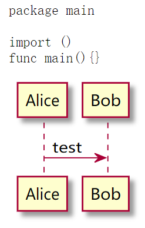
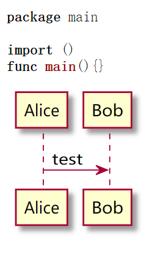

# goldmark-plantuml

[](https://gitee.com/OhYee/goldmark-plantuml) [](https://github.com/OhYee/goldmark-plantuml/actions) [](https://codecov.io/gh/OhYee/goldmark-plantuml) [](https://github.com/OhYee/goldmark-plantuml/tags)

goldmark-plantuml is an extension for [goldmark](https://github.com/yuin/goldmark).  

You can plantuml to build svg image in your markdown like [mume](https://github.com/shd101wyy/mume)

## Usage

### Only use this extension

```go
goldmark.New( 
  goldmark.WithExtensions( 
    extension.GFM, 
    uml.Default, 
  ), 
  goldmark.WithParserOptions( 
    parser.WithAutoHeadingID(), 
  ), 
  goldmark.WithRendererOptions(), 
 ) 
```

### Use with other fenced codeblock extensions

If you are using other fenced codeblock extensions(such as [yuin/goldmark-highlighting](https://github.com/yuin/goldmark-highlighting)), new extensions will override the old one.

You can use [OhYee/goldmark-fenced_codeblock_extension](https://github.com/OhYee/goldmark-fenced_codeblock_extension) to fix it.

Just init goldmark like this
(`50` is LRU cache size)

```go
goldmark.New(
  goldmark.WithExtensions(
    extension.GFM,
    ext.NewExt(
      uml.RenderMap(50, "plantuml-svg"),
      ext.RenderMap{
        Languages:      []string{"*"},
        RenderFunction: ext.GetFencedCodeBlockRendererFunc(highlighting.NewHTMLRenderer()),
      },
    ),
  ),
  goldmark.WithParserOptions(
    parser.WithAutoHeadingID(),
  ),
  goldmark.WithRendererOptions(),
)
```
If you have more than two fenced codeblock extensions, you can register them like this

```go
ext.NewExt(
	ext.RenderMap{
		Languages:      []string{"mermaid"},
		RenderFunction: mermaid.NewMermaid(50, "mermaid").Renderer,
	},
	ext.RenderMap{
		Languages:      []string{"dot-svg"},
		RenderFunction: dot.NewDot(50, "dot-svg").Renderer,
	},
	ext.RenderMap{
		Languages:      []string{"uml-svg"},
		RenderFunction: uml.NewUML(50, "uml-svg").Renderer,
	},
	ext.RenderMap{
		Languages:      []string{"python-output"},
		RenderFunction: python.NewPython(50, "python3", "python-output").Renderer,
	},
	ext.RenderMap{
		Languages: []string{"*"},
		RenderFunction: ext.GetFencedCodeBlockRendererFunc(
			highlighting.NewHTMLRenderer(
				highlighting.WithGuessLanguage(true),
				highlighting.WithStyle("trac"),
			),
		),
	},
)
```

`ext.NewExt()` will combine fenced codeblock extensions as one extension, and accounding `ext.RenderMap.Languages` to decide which renderer will be used.

See more:
- https://github.com/OhYee/goldmark-plantuml/issues/2
- https://github.com/OhYee/goldmark-plantuml/blob/master/demo/demo2/main.go
- https://github.com/OhYee/blotter/blob/7f1426754ded43db9471fb8f1d8e7edd78dcdc68/api/pkg/markdown/main.go#L24-L92

## screenshot

There are two demo(using `'` instead of &#8242; in the code block)

1. default config

[Demo1](demo/demo1/main.go)
[Output1](demo/demo1/output.html)

```markdown
'''go
package main

import ()

func main(){}
'''

'''plantuml
@startuml
Alice -> Bob: test
@enduml
'''
```



2. using `plantuml-svg` and [goldmark-highlighting extension](https://github.com/yuin/goldmark-highlighting)

[Demo2](demo/demo1/main.go)
[Output2](demo/demo1/output.html)

```markdown
'''go
package main

import ()

func main(){}
'''

'''plantuml-svg
@startuml
Alice -> Bob: test
@enduml
'''
```



## Installation

```bash
go get -u github.com/OhYee/goldmark-plantuml
```

## License

[MIT](LICENSE)
